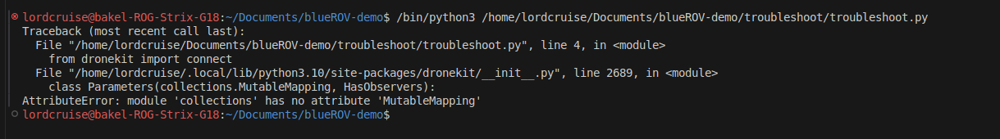
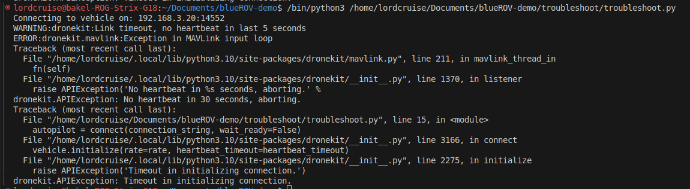
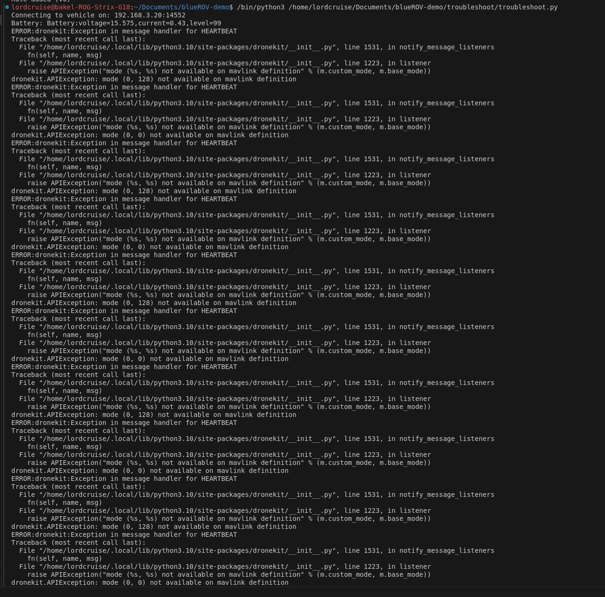

# Troubleshooting the ROV

To confirm that the BlueROV is sending data to port 5600, you can check a few things:

1. Use netstat or ss to Check Open Ports:
You can use netstat or ss to see if your system is listening on port 5600.

Using netstat:
bash
Copy
sudo netstat -tuln | grep 5600
Using ss:
bash
Copy
sudo ss -tuln | grep 5600
This will show if there is an active listener on port 5600. You should see something like:

markdown
Copy
udp    UNCONN     0      0         *:5600                 *:*
If you don’t see this, the BlueROV might not be sending data to that port.

Testing with VLC
Alternatively, you can also try opening the UDP stream in VLC:

sudo apt install vlc

Open VLC and go to Media > Open Network Stream.

Enter the URL: udp://@192.168.3.10:5600.

If the stream is being sent correctly, VLC should display the video.

2. wait_ready = False

🔧 Option 1: Patch DroneKit locally
Edit this file:

bash
Copy
Edit
~/.local/lib/python3.10/site-packages/dronekit/__init__.py
Find the line that looks like this:

python
Copy
Edit
from collections import MutableMapping
And change it to:

python
Copy
Edit
from collections.abc import MutableMapping
Do the same for Mapping, Sequence, etc. if you see similar errors later.

📦 Option 3: Use DroneKit fork
Someone already patched it on GitHub. Install the fixed fork via:

bash
Copy
Edit
pip uninstall dronekit
pip install git+https://github.com/Shojib/fl-dronekit.git

Solution: sudo ufw allow 14552/udp

pip install pymavlink==2.4.41